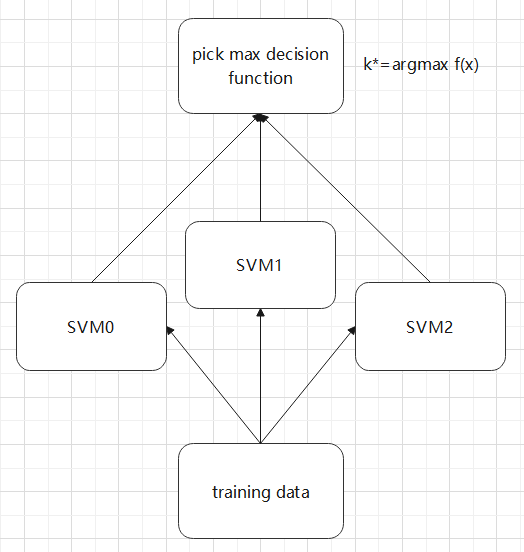
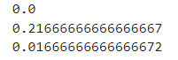

# Name: Xiang Fei
# Student ID: 120090414
<div STYLE="page-break-after: always;"></div>

# Contents
## 1. Written Questions
### 1.1 Question 1
### 1.2 Question 2
### 1.3 Question 3
### 1.4 Question 4
### 1.5 Question 5
### 1.6 Question 6
## 2. Programming Question
### 2.1 Question restatement
### 2.3 One vs rest strategy (Explanation and implementation)
### 2.4 Results (including the derivation of the optimization problem)

<div STYLE="page-break-after: always;"></div>

# 2. Programming Question
## 2.1 Question restatement
In this programming problem, we need to write a program that construct support vector machine models with different kernel functions and slack variable. We need to implement hard margin svm, soft margin svm, svm with Polynomial kernel(degree 2 and 3), svm with Radial Basis Function (RBF) kernel($\sigma=1$) and svm with Sigmoidal kernel($\sigma=1$). The datasets we use is one of most popular classification dataset in machine learning area: [Iris dataset](https://archive.ics.uci.edu/ml/datasets/iris), including 120 training data and 30 testing data, respectively. The datasets contains 3 different classes(labels) of 50 instances each: setosa(label 0), versicolor(label 1) and virginica(label 2), which represents the type of iris plant. And for each instance, it has four different features: sepal width, sepal length, petal width and petal length. 

## 2.3 One vs rest strategy (Explanation and implementation)
### 2.3.1 Explanation
one vs rest strategy is an approach used in Multi-class SVM. To classify multiple classes, we use this strategy to convert K binary classification to a K-class classification. The following graph shows the processing logic.



### 2.3.2 Implementation
We use sklearn.svm.SVC to construct support vector machine, since it provides attributes about support vectors while others don't provide these attributes. However, there is a problem that SVC only implement one vs one strategy. As a result, we need to implement one vs rest strategy manually. We can manually aggregating two classes into one and construct three binary classification svm using one vs one strategy. And then, we compare the decision function of each svm, and find the one which has the maximum decision function value. Finally, we can get the predicted label of given data. The python code is in the following (linear svm as example).

* construct three binary support vector machine and compute the corresponding parameters and support indices.
```python
manual_Ytrain = [0]*len(self.Y_train)
clf1 = SVC(C=C,kernel='linear',decision_function_shape='ovo')
for i in range(len(self.Y_train)):
    if self.Y_train[i] == 0:
        manual_Ytrain[i] = 1 
    else:
        manual_Ytrain[i] = -1
clf1.fit(self.X_train,manual_Ytrain)
w_setosa = clf1.coef_[0]
b_setosa = clf1.intercept_[0]
svi_setosa = clf1.support_

clf2 = SVC(C=C,kernel='linear',decision_function_shape='ovo')
for i in range(len(self.Y_train)):
    if self.Y_train[i] == 1:
        manual_Ytrain[i] = 1 
    else:
        manual_Ytrain[i] = -1
clf2.fit(self.X_train,manual_Ytrain)
w_versicolor = clf2.coef_[0]
b_versicolor = clf2.intercept_[0]
svi_versicolor = clf2.support_

clf3 = SVC(C=C,kernel='linear',decision_function_shape='ovo')
for i in range(len(self.Y_train)):
    if self.Y_train[i] == 2:
        manual_Ytrain[i] = 1 
    else:
        manual_Ytrain[i] = -1
clf3.fit(self.X_train,manual_Ytrain)
w_virginica = clf3.coef_[0]
b_virginica = clf3.intercept_[0]
svi_virginica = clf3.support_
```

* find the max decision function value of training data and test data to do the classification.
```python
d1 = clf1.decision_function(self.X_train)
d2 = clf2.decision_function(self.X_train)
d3 = clf3.decision_function(self.X_train)
Y_train_pred = [0]*len(self.Y_train)
for i in range(len(self.Y_train)):
    f1 = d1[i]
    f2 = d2[i]
    f3 = d3[i]
    if f1>=f2 and f1>=f3:
        Y_train_pred[i] = 0
    elif f2>=f1 and f2>=f3:
        Y_train_pred[i] = 1
    else:
        Y_train_pred[i] = 2
d1_test = clf1.decision_function(self.X_test)
d2_test= clf2.decision_function(self.X_test)
d3_test = clf3.decision_function(self.X_test)
Y_test_pred = [0]*len(self.Y_test)
for i in range(len(self.Y_test)):
    f1_test = d1_test[i]
    f2_test = d2_test[i]
    f3_test = d3_test[i]
    if f1_test>=f2_test and f1_test>=f3_test:
        Y_test_pred[i] = 0
    elif f2_test>=f1_test and f2_test>=f3_test:
        Y_test_pred[i] = 1
    else:
        Y_test_pred[i] = 2
```

## 2.4 Results (including the derivation of the optimization problem)
### 2.4.1 Question 1: Standard SVM model
The primal problem:
$$
\min\limits_{\pmb w, b} \frac{1}{2}||\pmb w||^2\\
s.t. 1-y_i(\pmb w^T \pmb x_i + b) \leq 0, \forall i
$$

The dual problem:
$$
\max\limits_\alpha\sum\limits_i^m\alpha_i\alpha_jy_iy_j \pmb x_i^T \pmb x_j\\
s.t.  \sum\limits_i^m\alpha_iy_i=0, \alpha_i\geq0,\forall i
$$

Since SVC doesn't support hard margin, or perfect separable data. Therefore, I simulate the standard SVM model by setting the penal parameter $C=1e5$.

I compute the training error and testing error as the following:
```python
train_error = 1 - sum(Y_train_pred==self.Y_train)/len(self.Y_train)
test_error = 1 - sum(Y_test_pred==self.Y_test)/len(self.Y_test)
```
The error:

$training\ error=0.04166666666666663$

$testing\ error=0.0$

#### Linear separable problem
Since the data provided is not necessarily linearly separable, therefore we need to find out which classes and the rest are not linearly separable. In fact, we can just check the training error of the three ovo model respectively. If the error is not 0, then the class and the rest are not linearly separable. The python code is like the following:

```python
svm1_train_pred = clf1.predict(self.X_train)
svm1_train_error = 1 - sum(svm1_train_pred==manual_Ytrain)/len(manual_Ytrain)
print(svm1_train_error)
svm2_train_pred = clf2.predict(self.X_train)
svm2_train_error = 1 - sum(svm2_train_pred==manual_Ytrain)/len(manual_Ytrain)
print(svm2_train_error)
svm3_train_pred = clf3.predict(self.X_train)
svm3_train_error = 1 - sum(svm3_train_pred==manual_Ytrain)/len(manual_Ytrain)
print(svm3_train_error)
```

And we get the result:



It means the training error of model1 is 0, and the training error of model2 and model3 are bigger than 0. So we get the result: 

Class1 and the rest are linearly separable.

Class2 and the rest are not linearly separable.

Class3 and the rest are not linearly separable.

### 2.4.2 Question 2: SVM with slack variables (linear kernel)
The primal problem:
$$
\min\limits_{w,b,\xi_i}\frac{1}{2}||\pmb{w}||^2+C\sum\limits_i^m\xi_i\\
s.t.  1-\xi_i-y_i(\pmb{w^T}\pmb{x_i}+b) \leq 0,\xi_i\geq0,\forall i
$$
Lagrange function:
$$
L(\pmb w, b, \alpha) = \frac{1}{2}||\pmb{w}||^2 + C\sum_i^m\xi_i + \sum_i^m[\alpha_i(1-\xi_i-y_i(\pmb{w^T}\pmb{x_i}+b)) - u_i\xi_i]
$$
KKT condition:

Stationarity:
$$
\frac{\partial L}{\partial \pmb{w}} = 0,  \ \  \pmb{w} = \sum_i^m\alpha_iy_i\pmb{x_i}\\
\frac{\partial L}{\partial b} = 0, \ \  \sum_i^ma_iy_i=0\\
\frac{\partial L}{\partial \xi_i} = 0, \ \  \alpha_i=C-\mu_i, \forall i
$$
Feasibility:
$$
\alpha_i \geq 0, 1-\xi_i-y_i(\pmb{w^Tx_i}+b) \leq 0, \xi_i \geq 0, \mu_i \geq 0, \forall i
$$
Complementary slackness:
$$
\alpha_i(1-\xi_i-y_i(\pmb{w^Tx_i}+b)) = 0, \mu_i\xi_i=0, \forall i
$$
Then, we can get the dual problem:
$$
\max\limits_\alpha\sum\limits_i^m\alpha_i\alpha_jy_iy_j\pmb{x_i^T}\pmb{x_j}\\
s.t.  \sum\limits_i^m\alpha_iy_i=0, \alpha_i\geq0,\forall i
$$

For each $C=0.1\times t,t=1,2,...,10$, I fit my algorithm and get the error.

* $C=0.1$:$training\ error=0.125$; $testing\ error=0.23333333333333328$
* $C=0.2$:$training\ error=0.05833333333333335$; $testing\ error=0.16666666666666663$
* $C=0.3$:$training\ error=0.050000000000000044$; $testing\ error=0.1333333333333333$
* $C=0.4$:$training\ error=0.050000000000000044$; $testing\ error=0.09999999999999998$
* $C=0.5$:$training\ error=0.050000000000000044$; $testing\ error=0.09999999999999998$
* $C=0.6$:$training\ error=0.050000000000000044$; $testing\ error=0.09999999999999998$
* $C=0.7$:$training\ error=0.050000000000000044$; $testing\ error=0.09999999999999998$
* $C=0.8$:$training\ error=0.050000000000000044$; $testing\ error=0.09999999999999998$
* $C=0.9$:$training\ error=0.050000000000000044$; $testing\ error=0.06666666666666665$
* $C=1.0$:$training\ error=0.050000000000000044$; $testing\ error=0.06666666666666665$

### 2.4.3 Question 3: SVM with 2nd-order polynomial kernel and slack variables
The primal problem:
$$
\min\limits_{w,b,\xi_i} \frac{1}{2}||\pmb{w}||^2 + C\sum_i \xi_i\\
s.t. 1-y_i(\pmb{w^T \phi(x_i)} + b) \leq 0, \forall i
$$
Lagrange function:
$$
L(\pmb{w}, b, \alpha) = \frac{1}{2}||\pmb{w}||^2 + C\sum_i^m\xi_i + \sum_i^m[\alpha_i(1-\xi_i-y_i(\pmb{w^T\phi(x_i)}+b)) - u_i\xi_i]
$$
KKT condition:

Stationarity:
$$
\frac{\partial L}{\partial \pmb{w}} = 0,  \ \  \pmb{w} = \sum_i^m\alpha_iy_i\phi(\pmb{x_i})\\
\frac{\partial L}{\partial b} = 0, \ \  \sum_i^ma_iy_i=0\\
\frac{\partial L}{\partial \xi_i} = 0, \ \  \alpha_i=C-\mu_i, \forall i
$$
Feasibility:
$$
\alpha_i \geq 0, 1-\xi_i-y_i(\pmb{w^T}\phi(\pmb{x_i})+b) \leq 0, \xi_i \geq 0, \mu_i \geq 0, \forall i
$$
Complementray slackness:
$$
\alpha_i(1-\xi_i-y_i(\pmb{w^T}\phi(\pmb{x_i})+b)) = 0, \mu_i\xi_i=0, \forall i
$$
Then, we can get the dual problem:
$$
\max\limits_{\alpha_i} \sum_i^m\alpha_i-\frac{1}{2}\sum_{i, j}\alpha_i\alpha_iy_iy_i\phi(\pmb{x_i})^T\phi(\pmb{x_j})\\
$$
Here, we use the kernel ($\gamma=1$):
$$
k(\pmb{x}, \pmb{x_i}) = (\pmb{x^T}\pmb{x_i})^2
$$
Therefore, we can get the final dual problem
$$
\max\limits_{\alpha_i} \sum_i^m\alpha_i-\frac{1}{2}\sum_{i, j}\alpha_i\alpha_jy_iy_j(\pmb{x^T}\pmb{x_i})^2\\
s.t.\sum_i^m\alpha_iy_i=0, 0 \leq \alpha_i \leq C, \forall i
$$

We set the panel parameter $C=1$ and get the error:

$training\ error=0.025000000000000022$

$testing\ error=0.0$

### 2.4.4 Question 4: SVM with 3nd-order polynomial kernel and slack variables
The primal problem:
$$
\min\limits_{w,b,\xi_i} \frac{1}{2}||\pmb{w}||^2 + C\sum_i \xi_i\\
s.t. 1-y_i(\pmb{w^T \phi(x_i)} + b) \leq 0, \forall i
$$
Lagrange function:
$$
L(\pmb{w}, b, \alpha) = \frac{1}{2}||\pmb{w}||^2 + C\sum_i^m\xi_i + \sum_i^m[\alpha_i(1-\xi_i-y_i(\pmb{w^T}\phi(\pmb{x_i})+b)) - u_i\xi_i]
$$
KKT condition:

Stationarity:
$$
\frac{\partial L}{\partial\pmb{w}} = 0,  \ \  \pmb{w} = \sum_i^m\alpha_iy_i\phi(\pmb{x_i})\\
\frac{\partial L}{\partial b} = 0, \ \  \sum_i^ma_iy_i=0\\
\frac{\partial L}{\partial \xi_i} = 0, \ \  \alpha_i=C-\mu_i, \forall i
$$
Feasibility:
$$
\alpha_i \geq 0, 1-\xi_i-y_i(\pmb{w^T}\phi(\pmb{x_i})+b) \leq 0, \xi_i \geq 0, \mu_i \geq 0, \forall i
$$
Complementray slackness:
$$
\alpha_i(1-\xi_i-y_i(\pmb{w^T}\phi(\pmb{x_i})+b)) = 0, \mu_i\xi_i=0, \forall i
$$
Then, we can get the dual problem:
$$
\max\limits_{\alpha_i} \sum_i^m\alpha_i-\frac{1}{2}\sum_{i, j}\alpha_i\alpha_iy_iy_i\phi(\pmb{x_i})^T\phi(\pmb{x_j})\\
$$
Here, we use the kernel ($\gamma=1$):
$$
k(\pmb{x}, \pmb{x_i}) = (\pmb{x^T}\pmb{x_i})^3
$$
Therefore, we can get the final dual problem
$$
\max\limits_{\alpha_i} \sum_i^m\alpha_i-\frac{1}{2}\sum_{i, j}\alpha_i\alpha_jy_iy_j(\pmb{x^T}\pmb{x_i})^3\\
s.t.\sum_i^m\alpha_iy_i=0, 0 \leq \alpha_i \leq C, \forall i
$$

We set the panel parameter $C=1$ and get the error:

$training\ error=0.008333333333333304$

$testing\ error=0.0$

### 2.4.5 Question 5: SVM with Radial Basis Function kernel and slack variables
The primal problem:
$$
\min\limits_{w,b,\xi_i} \frac{1}{2}||\pmb{w}||^2 + C\sum_i \xi_i\\
s.t. 1-y_i(\pmb{w^T \phi(x_i)} + b) \leq 0, \forall i
$$
Lagrange function:
$$
L(\pmb{w}, b, \alpha) = \frac{1}{2}||\pmb{w}||^2 + C\sum_i^m\xi_i + \sum_i^m[\alpha_i(1-\xi_i-y_i(\pmb{w^T}\phi(\pmb{x_i})+b)) - u_i\xi_i]
$$
KKT condition:

Stationarity:
$$
\frac{\partial L}{\partial \pmb{w}} = 0,  \ \  \pmb{w} = \sum_i^m\alpha_iy_i\phi(\pmb{x_i})\\
\frac{\partial L}{\partial b} = 0, \ \  \sum_i^ma_iy_i=0\\
\frac{\partial L}{\partial \xi_i} = 0, \ \  \alpha_i=C-\mu_i, \forall i
$$
Feasibility:
$$
\alpha_i \geq 0, 1-\xi_i-y_i(\pmb{w^T}\phi(\pmb{x_i})+b) \leq 0, \xi_i \geq 0, \mu_i \geq 0, \forall i
$$
Complementray slackness:
$$
\alpha_i(1-\xi_i-y_i(\pmb{w^T}\phi(\pmb{x_i})+b)) = 0, \mu_i\xi_i=0, \forall i
$$
Then, we can get the dual problem:
$$
\max\limits_{\alpha_i} \sum_i^m\alpha_i-\frac{1}{2}\sum_{i, j}\alpha_i\alpha_iy_iy_i\phi(\pmb{x_i})^T\phi(\pmb{x_j})\\
$$
Here, we use the kernel ($\gamma=\frac{1}{2}$):
$$
k(\pmb{x}, \pmb{x_i}) = exp(-\frac{||\pmb{x}-\pmb{x_i}||^2}{2})
$$
Therefore, we can get the final dual problem
$$
\max\limits_{\alpha_i} \sum_i^m\alpha_i-\frac{1}{2}\sum_{i, j}\alpha_i\alpha_jy_iy_j exp(-\frac{||\pmb{x}-\pmb{x_i}||^2}{2})\\
s.t.\sum_i^m\alpha_iy_i=0, 0 \leq \alpha_i \leq C, \forall i
$$

We set the panel parameter $C=1$ and get the error:

$training\ error=0.033333333333333326$

$testing\ error=0.033333333333333326$

### 2.4.6 Question 5: SVM with Sigmoidal kernel and slack variables
The primal problem:
$$
\min\limits_{w,b,\xi_i} \frac{1}{2}||\pmb{w}||^2 + C\sum_i \xi_i\\
s.t. 1-y_i(\pmb{w^T \phi(x_i)} + b) \leq 0, \forall i
$$
Lagrange function:
$$
L(\pmb{w}, b, \alpha) = \frac{1}{2}||\pmb{w}||^2 + C\sum_i^m\xi_i + \sum_i^m[\alpha_i(1-\xi_i-y_i(\pmb{w^T}\phi(\pmb{x_i})+b)) - u_i\xi_i]
$$
KKT condition:

Stationarity:
$$
\frac{\partial L}{\partial \pmb{w}} = 0,  \ \  \pmb{w} = \sum_i^m\alpha_iy_i\phi(\pmb{x_i})\\
\frac{\partial L}{\partial b} = 0, \ \  \sum_i^ma_iy_i=0\\
\frac{\partial L}{\partial \xi_i} = 0, \ \  \alpha_i=C-\mu_i, \forall i
$$
Feasibility:
$$
\alpha_i \geq 0, 1-\xi_i-y_i(\pmb{w^T}\phi(\pmb{x_i})+b) \leq 0, \xi_i \geq 0, \mu_i \geq 0, \forall i
$$
Complementray slackness:
$$
\alpha_i(1-\xi_i-y_i(\pmb{w^T}\phi(\pmb{x_i})+b)) = 0, \mu_i\xi_i=0, \forall i
$$
Then, we can get the dual problem:
$$
\max\limits_{\alpha_i} \sum_i^m\alpha_i-\frac{1}{2}\sum_{i, j}\alpha_i\alpha_iy_iy_i\phi(\pmb{x_i})^T\phi(\pmb{x_j})\\
$$
Here, we use the kernel ($\gamma=\frac{1}{4}$ since $\pmb{x}$ is 4 dimension, in SVC, we set it as 'auto'):
$$
k(x, x_i) = \tanh(\frac{1}{4} \pmb{x^T}\pmb{x})
$$
Therefore, we can get the final dual problem
$$
\max\limits_{\alpha_i} \sum_i^m\alpha_i-\frac{1}{2}\sum_{i, j}\alpha_i\alpha_jy_iy_j\tanh(\frac{1}{4} \pmb{x^T}\pmb{x})\\
s.t.\sum_i^m\alpha_iy_i=0, 0 \leq \alpha_i \leq C, \forall i
$$

We set the panel parameter $C=1$ and get the error:

$training\ error=0.825$

$testing\ error=0.7666666666666666$