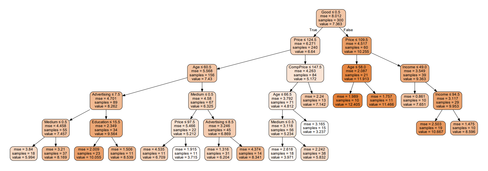
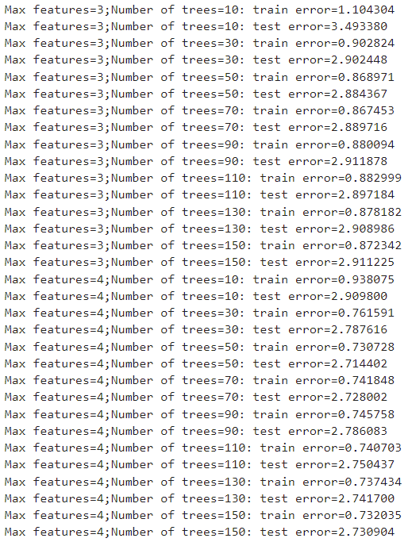

# Assignment3 Report
# Name: Xiang Fei
# Student ID: 120090414
<div STYLE="page-break-after: always;"></div>

# Contents
## 1. Written Questions
### 1.1 Question 1
### 1.2 Question 2
### 1.3 Question 3
### 1.4 Question 4
### 1.5 Question 5

## 2. Programming Question
### 2.1 Question restatement
### 2.2 Python Implementation
### 2.3 Data processing
### 2.4 Data statistics
### 2.5 Decision tree
### 2.6 Bagging of trees
### 2.7 Random forests
### 2.8 Bias-Variance analysis for random forests

<div STYLE="page-break-after: always;"></div>

# 2. Programming Question
## 2.1 Question restatement
In the programming problem, we need to solve a regression task using decision tree, bagging, and random forests with **sklearn** in python. First, we need to analyze the raw data. And then, for each method, we need to consider the train error and test error with different hyper-parameters. What's more, for decision tree case, we need to plot the tree structure. For random forests case, we need to do a bias-variance analysis.

## 2.2 Python Implementation
For data statistics, I write a function like the following.
```python
def data_statistics(df):
    target = df.iloc[:,0].values
    features = np.transpose(df.iloc[:,1:].values)
    plt.hist(target,bins=20)
    plt.xlabel('Sales')
    plt.ylabel('frequency')
    plt.show()
    for i in range(10):
        plt.hist(features[i],bins=20)
        if i == 0:
            plt.xlabel('CompPrice')
        if i == 1:
            plt.xlabel('Income')
        if i == 2:
            plt.xlabel('Advertising')
        if i == 3:
            plt.xlabel('Population')
        if i == 4:
            plt.xlabel('Price')
        if i == 5:
            plt.xlabel('ShelveLoc')
        if i == 6:
            plt.xlabel('Age')
        if i == 7:
            plt.xlabel('Education')
        if i == 8:
            plt.xlabel('Urban')
        if i == 9:
            plt.xlabel('US')
        plt.ylabel('frequency')
        plt.show()
```


For regression task, I construct a class called DecisionTree like the following.
```python
class DecisionTree(object):
    def __init__(self,dataframe):
        self.model = None
        self.dataframe = dataframe
        self.X_train = None
        self.Y_train = None 
        self.Y_train_pred = None
        self.X_test = None
        self.Y_test = None
        self.Y_test_pred = None
        self.mse_train = None
        self.mse_test = None
        self.max_depth = None
        self.min_node_size = None
        self.processing()
    
    def processing(self):
        # omit details

    def fit_dt(self,max_depth=None,min_node_size=2):
        # omit details

    def fit_bagging(self,number_of_trees,max_depth=None,min_node_size=2):
        # omit details

    def fit_random_forests(self,m,number_of_trees,max_depth=None,min_node_size=2):
        # omit details

    def plot_tree(self):
        # omit details

    def bias_variance_analysis(self,max_depth=None,min_node_size=2):
        # omit details
```
**precessing** is used to do the data processing. **fit_dt** is used to train a decision tree. **fit_bagging** is used to to train a bagging of trees. **fit_random_forests** is used to train a random forest. **plot_tree** is used to plot the structure of a decision tree. **bias_variance_analysis** is to used to do the bias-variance analysis.

## 2.3 Data processing
**Carseats** contains 400 data points, and I simply set the first 300 rows as the training set, and the remaining 100 raws as the testing set. And the most important thing in this part is the operation to change the form of discrete features. For 'Urban' and 'US', I treat them as dummy variables which value is 0(No) or 1(Yes). For 'ShelveLoc' feature, since it has three different values, I use one-hot method to change it to three different dummy variables with 0,1 values. The code is like the following.

```python
def processing(self):
    self.dataframe["Urban"] = self.dataframe["Urban"].replace("No",0)
    self.dataframe["Urban"] = self.dataframe["Urban"].replace("Yes",1)
    self.dataframe["US"] = self.dataframe["US"].replace("No",0)
    self.dataframe["US"] = self.dataframe["US"].replace("Yes",1)
    self.dataframe = self.dataframe.join(pd.get_dummies(self.dataframe.ShelveLoc))
    self.dataframe = self.dataframe.drop(columns=['ShelveLoc'])
    self.Y_train = self.dataframe.iloc[:300,0].values
    self.Y_test = self.dataframe.iloc[301:,0].values
    self.X_train = self.dataframe.iloc[:300,1:].values
    self.X_test = self.dataframe.iloc[301:,1:].values
```

## 2.4 Data statistics
I plot the frequency of Sales and each feature.

I find that Sales has more intermediate samples and less endpoint samples. CompPrice and Price also has similar distribution compared with Sales. The distribution of Income is relatively even, and so do Population, Age and Education. The left endpoint of Advertising distributes more samples. For ShelveLoc, the frequency of Bad and Good are similar, nearly half of that of Medium. And the distribution of Urban and US are similar, the frequency of No is about half of that of Yes.


## 2.5 Decision tree
Maximum depth: [3,4,5]

Least node size: [10,15,20]

The train error and test error is like the following:


The structure of the above trees:

**Maximum depth = 3, Least node size = 10:**


**Maximum depth = 3, Least node size = 15:**


**Maximum depth = 3, Least node size = 20:**


**Maximum depth = 4, Least node size = 10:**


**Maximum depth = 4, Least node size = 15:**


**Maximum depth = 4, Least node size = 20:**


**Maximum depth = 5, Least node size = 10:**



**Maximum depth = 5, Least node size = 15:**


**Maximum depth = 5, Least node size = 20:**


## 2.6 Bagging of trees
Number of trees: [10,30,50,70,90,110,130,150]

Maximum depth: [5,6,7]

The train error and test error is like the following:


## 2.7 Random forests
Max features: [3,4,5]

Number of trees: [10,30,50,70,90,110,130,150]

The train error and test error is like the following:




## 2.8 Bias-Variance analysis for random forests
### Bias^2


The number of trees and Bias^2 don't have obvious relationship. When the number of trees is increasing, we can't guarantee the change of Bias^2, as different trees are independent and the overall model complexity is not increased. 

### Variance


When the number of trees is increasing, the variances is reduced. And when number of trees is not large, the change of variance is significant. When the number of trees become large, the reduce of variance become gently.