# Assignment4 Report
# Name: Xiang Fei
# Student ID: 120090414

# Contents
## 1. Written Questions
### 1.1 Question 1
### 1.2 Question 2
### 1.3 Question 3
### 1.4 Question 4
### 1.5 Question 5

## 2. Programming Question
### 2.1 Question restatement
### 2.2 K-means
### 2.3 Accelerated K-means with triangle-inequality
### 2.4 GMM-EM
### 2.5 Evaluation
### 2.6 Sensitivity
### 2.7 Runtime Analysis

### Question 5
get the mean of X: here A is X in the question:

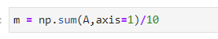

then do the normalization for A(in fact, get x(n)-mu):

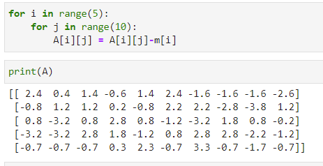

Calculate the empirical covariance matrix:

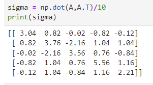

Then, compute eigenvectors and eigenvalues, and choose two of them.

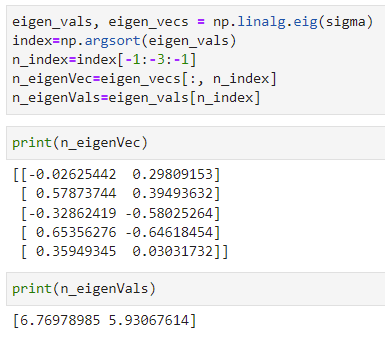

Finally, compute the projection:

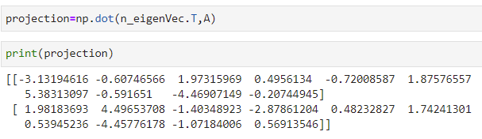

# 2. Programming Question
## 2.1 Question restatement
In the programming problem, we need to implement 3 clustering algorithms from scratch, including K-means, accelerated K-means with triangle-inequality, GMM-EM. And then, we need to use an internal evaluation metrics: Silhouette coefficient and an external evaluation metrics: Rand Index to evaluate the performance of the above algorithms. What's more, we are also required to analyze the sensitivity to clustering initialization of each algorithm. Last, we need to record the corresponding iteration numbers and the required runtime for each algorithm.

## 2.2 K-means
First, I write a function to compute the Euclidean distance between two points. Then, I write a function to initialize centroids with random samples. Here I use random.uniform(0,len(data)) to generate k index and then can have k initial points as the original centroids. And then is a function to implement the main processing logic of K-means algorithm. We iteratively assignment and refitting until the assignment will not change the clustering. In assignment part, we find the closest centroid for each point, and in refitting part, we update the centroids in the given assignment.

The final centroids is like the following:

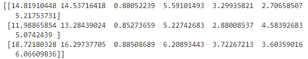

The final clustering is like the following:

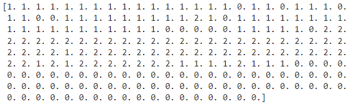

## 2.3 Accelerated K-means with triangle-inequality
We can accelerate the K-means algorithms by reducing the computational distances according to Elkan and based on the triangle-inequality. Let x be a data point, and b and c be two centers. d(x, b) denotes the distance
between x and b. We have two lemma:
* Lemma 1: if d(b, c) ≥ 2d(x, b), then d(x, c) > d(x, b)
* Lemma 2: d(x, c) > max{0, d(x, b) − d(d, c)}
Based on these two lemmas, we can implement the accelerated K-means algorithm.

I first write a function to get the distances between different centers (d(c,c')). Then, I use random.sample to get the initial centroids. Then is the first step of accelerated K-means, I named it as initialize_acc_k_means. In this part, we first pick the initial centers. Then set the lower bound l(x,c)=0 for each point x and center c. Assign each x to its closest initial center c(x) = $argmin_c$(d(x)), using Lemma1 here to avoid redundant distance calculations. Each time d(x,c) is computed, set l(x,c)=d(x,c). Assign upper bound u(x)=$min_c$d(x,c).

Then, I write a function called assignment to update the clustering. For all centers c, compute sc = 0.5*min_(c!=c')(d(c,c')). Then, identify all points x such that u(x)<=s(c(x)). If u(x)<=s(c(x)), no need to re-assignment. For all remaining points x and center c, if no need to re-assignment, compute d(x,c(x)), and change the need flag to be true. Otherwise, d(x,c(x))=u(x). Then, check whether d(x,c(x))>l(x,c) or d(x,c(x))>0.5*d(c(x),c), if it is true, compute d(x,c). If d(x,c)<d(x,c(x)), then change d(x,c(x)) and the clustering for x.

And then, I write a function called update the centroid. m(c) is the mean of the points assigned to center c. For each point x and center c, assign l(x,c)=max{l(x,c)-d(c,m(c)),0}. And for each point x and center c, assign l(x,c)=max{l(x,c)-d(c,m(c)),0}. For each point x, assign u(x) = u(x)-d(m(c(x)),c(x)).

repeat the above two process until convergence(there is no different between current centroids and the previous centroids).

The final centroids is like the following:

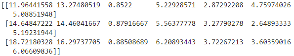

The final clustering is like the following:

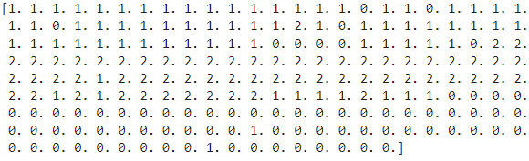

## 2.4 GMM-EM
For GMM-EM algorithm, we use two part to implement it: Expectation and Maximization. 

For Expectation part, we use bayes theorem to get the gamma. Here p(z=k)=pi_k, and p(x|z=k) follows multivariate normal distribution.

For Maximization part, we compute mu_k, cov_k and pi_k using the given optimized formula.

We repeat the two steps until convergence(here we compute log likelihood to check the convergence).

The final clustering is like the following:

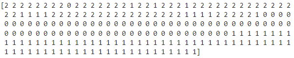

## 2.5 Evaluation
### 2.5.1 Silhouette Coefficient
Given a clustering, we define
* a: The mean distance between a point and all other points in the same
cluster.
* b: The mean distance between a point and all other points in the next
nearest cluster

Silhouette coefficient s for a single sample is formulated as:
s = (b-a)/max(a,b)

For all samples, compute the average Silhouette coefficient s.

The result for the above three clustering algorithms:

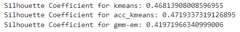

### 2.5.2 Rand index
Given a set of n samples S = {o1, o2, . . . , on}, there are two clusterings/partitions of S to compare, including:

* X = {X1, X2, . . . , Xr} with r clusters
* Y = {Y1, Y2, . . . , Ys} with s clusters

We can calculate the following values:
* a: The number of pairs of elements in S that are in the same subset in X
and in the same subset in Y
* b: The number of pairs of elements in S that are in the different subset in
X and in the different subset in Y
* c: The number of pairs of elements in S that are in the same subset in X
and in the different subset in Y
* d: The number of pairs of elements in S that are in the different subset in
X and in the same subset in Y

The rand index (RI) can be computed as follows:

RI=(a+b)/(a+b+c+d) 

Note that RI ∈ [0, 1], and higher score corresponds higher similarity

The result for the above three clustering algorithms:

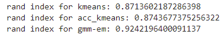

## 2.6 Sensitivity
In this part, I run one clustering algorithm with random initialization multiple times, and calculate the variance of evaluation scores of these clustering results.

Results:

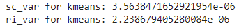

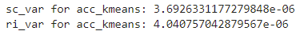

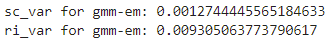

## 2.7 Runtime Analysis
In this part, I run one clustering algorithm with random initialization multiple times, and calculate the average number of iterations and average time.

Results:

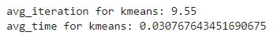

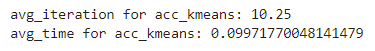

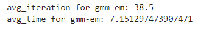